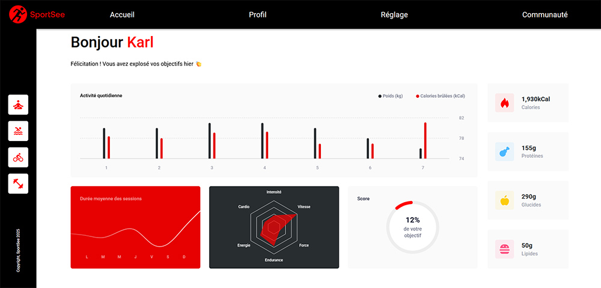

# Projet 12 : SportSee - Dashboard Analytics

12ème projet de la formation "Développeur d'application JavaScript React" d'OpenClassrooms.



## Description

SportSee est une application de dashboard analytics permettant aux utilisateurs de visualiser leurs données sportives. L'application communique avec une API pour récupérer les données des utilisateurs et les affiche notamment sous forme de différents graphiques grâce à la librairie Recharts.

## Prérequis

- [Node.js](https://nodejs.org/en/)
- [Backend API SportSee](https://github.com/OpenClassrooms-Student-Center/SportSee)

## Installation

1. **Cloner le projet**

```bash
git clone https://github.com/nrundstadler/OCR-P12-SportSee
cd OCR-P12-SportSee
```

2. **Installer les dépendances**

```bash
npm install
```

3. **Lancer l'application**

```bash
npm run dev
```

L’application sera accessible à l’adresse http://localhost:5173/ (ou autre port indiqué par Vite).

## Fonctionnalités

- Visualisation de l'activité quotidienne (poids, calories)
- Durée moyenne des sessions par jour
- Performance
- Score d'accomplissement des objectifs
- Métriques clés (calories, protéines, glucides, lipides)

## Architecture

- `/src/components` : Composants React réutilisables
- `/src/services` : Services pour l'API et le formatage des données
- `/src/hooks` : Custom hooks React
- `/src/pages` : Pages de l'application
- `/src/data` : Données mockées pour le développement

## Technologies utilisées

- React 19 : Bibliothèque JavaScript pour créer l'interface utilisateur
- React Router : Navigation entre les différentes pages
- Recharts : Bibliothèque de graphiques basée sur React et D3.js pour la visualisation des données
- TailwindCSS : Framework CSS utilitaire pour le style
- Vite : Build tool rapide pour le développement

## Mode de données

L'application propose deux modes de données :

- Données mockées : `/profile-mocked/:userId`
- Données API : `/profile/:userId` (nécessite le lancement du [Backend](https://github.com/OpenClassrooms-Student-Center/SportSee))

## Utilisateurs disponibles

- ID: 12 (Karl)
- ID: 18 (Cecilia)

## Scripts disponibles

- `npm run dev` : Lance le serveur de développement
- `npm run build` : Compile l'application pour la production
- `npm run lint` : Vérifie le code avec ESLint
- `npm run preview` : Prévisualise la version de production

<br><br>

# English

## Project 12: SportSee - Analytics Dashboard

12th project of OpenClassrooms "JavaScript React Application Developer" training program.


### Description

SportSee is an analytics dashboard application that allows users to visualize their sports data. The application communicates with a API to fetch user data and displays it through various charts using the Recharts library.

Users can track:

- Daily activity (weight and calories)
- Average session duration
- Performance on different activities
- Goal achievement score
- Key metrics (calories, protein, carbs, lipids)

### Prerequisites

- [Node.js](https://nodejs.org/en/)
- [Backend API SportSee](https://github.com/OpenClassrooms-Student-Center/SportSee)

### Installation

1. **Clone the project**

```bash
git clone https://github.com/nrundstadler/OCR-P12-SportSee
cd OCR-P12-SportSee
```

2. **Install dependencies**

```bash
npm install
```

3. **Launch the application**

```bash
npm run dev
```

The application will be available at http://localhost:5173/ (or another port specified by Vite).

### Architecture

- `/src/components`: Reusable React components
- `/src/services`: API and data formatting services
- `/src/hooks`: React custom hooks
- `/src/pages`: Application pages
- `/src/data`: Mock data for development

### Tech Stack

- React 19: JavaScript library for building user interfaces
- React Router: Navigation between pages
- Recharts: React-based charting library built on D3.js
- TailwindCSS: Utility-first CSS framework
- Vite: Fast build tool for development

### Data Modes

The application offers two data modes:

- Mock data: `/profile-mocked/:userId`
- API data: `/profile/:userId` (requires running the [Backend](https://github.com/OpenClassrooms-Student-Center/SportSee))

### Available Users

- ID: 12 (Karl)
- ID: 18 (Cecilia)

### Available Scripts

- `npm run dev`: Start development server
- `npm run build`: Build application for production
- `npm run lint`: Check code with ESLint
- `npm run preview`: Preview production build
